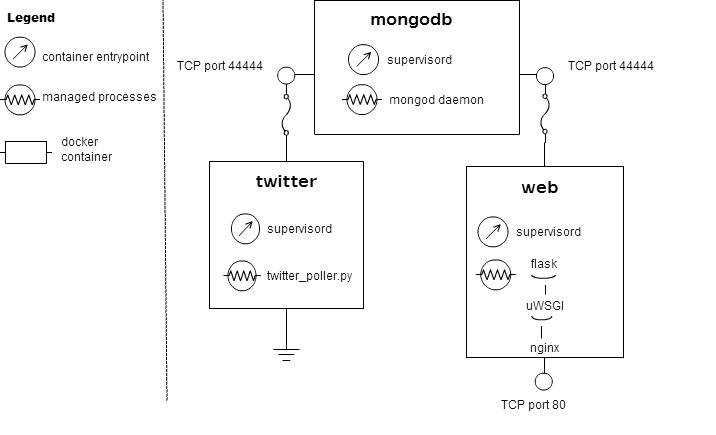

# airquality docker deployment

Deploys the [airquality app](https://github.com/javouhey/airquality) using docker.

## Docker containers

Docker allows us to apply the SRP (single responsibility principle) to our deployment process.

## How it works

TBD
